 bandwidth scanner ⚖🌏
=====================================================


[juga at torproject dot net](juga at torproject dot net)

Brussels, Belgium, January 2019

----  ----

Content
========

1. What is a bandwidth scanner
1. How sbws scanner works
1. How sbws generator works
1. Bandwidth File
1. Questions
1. How bandwidth files will appear in Tor
1. Metrics - bandwidth authorities
1. Metrics - monitoring bandwidth
1. Bandwidth values in Tor
1. sbws goals
1. sbws relays' bandwidth distribution
1. sbws system packages
1. Open questions
1. sbws technical debt

----  ----

Assumptions
============

- What is a directory authority
- What are votes and consensus documents

----  ----

What is a bandwidth scanner
===========================

----

descriptor observed bandwidth

----

Torflow

----

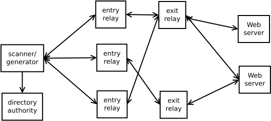

----  ----

How the scanner works?
=======================

----

sbws source content
--------------------

```
.
├── sbws
│   ├── config.default.ini
│   ├── config.log.default.ini
│   ├── core
│   │   ├── cleanup.py
│   │   ├── generate.py
│   │   ├── __init__.py
│   │   ├── scanner.py
│   │   └── stats.py
│   ├── globals.py
│   ├── __init__.py
│   ├── lib
│   │   ├── circuitbuilder.py
│   │   ├── destination.py
│   │   ├── __init__.py
│   │   ├── relaylist.py
│   │   ├── relayprioritizer.py
│   │   ├── resultdump.py
│   │   └── v3bwfile.py
│   ├── sbws.py
│   └── util
│       ├── config.py
│       ├── filelock.py
│       ├── fs.py
│       ├── __init__.py
│       ├── parser.py
│       ├── requests.py
│       ├── state.py
│       ├── stem.py
│       ├── timestamp.py
│       └── userquery.py
```

----

```text
sbws scanner
```

```
Using configuration file /home/foo/.sbws.ini
Jan 25 19:58:19 INFO MainThread sbws.py:73 - main - sbws 1.0.3-dev0 with python 3.5.3 on Linux-4.9.0-8-amd64-x86_64-with-debian-9.6, stem 1.7.0, and requests 2.19.1
Jan 25 19:58:23 INFO MainThread stem.py:208 - launch_tor - Started and connected to Tor 0.3.5.7 via /run/user/1000/sbws/tor/control
Jan 25 19:58:29 INFO Thread-1 resultdump.py:137 - load_recent_results_in_datadir - Reading and processing previous measurements.
Jan 25 19:58:29 INFO MainThread scanner.py:372 - run_speedtest - Starting a new loop to measure relays.
Jan 25 19:59:14 INFO Thread-1 resultdump.py:582 - handle_result - Success measuring D71E2BB7859D0D0DAE5CA3677176C940446E077A (bravenewworld) via circuit ['4FDDFAD51B24DDABB62FB59071F4DC421E76C685', 'D71E2BB7859D0D0DAE5CA3677176C940446E077A'] and destination https://example.example/1G
Jan 25 19:59:14 INFO Thread-1 resultdump.py:582 - handle_result - Success measuring F4FB9A80308AE71CA8057F4158DD6B3C8EE375F9 (Unnamed) via circuit ['F4FB9A80308AE71CA8057F4158DD6B3C8EE375F9', '9E2D7C6981269404AA1970B53891701A20424EF8'] and destination https://example.example/1G
Jan 25 20:00:29 INFO Thread-1 resultdump.py:582 - handle_result - Error measuring D733CA14438BEEE2474B8F483AD5538F28D6A3F9 (snap269) via circuit ['D733CA14438BEEE2474B8F483AD5538F28D6A3F9', 'B740BCECC4A9569232CDD45C0E1330BA0D030D33'] and destination https://example.example/1G
```

----

Initialize
------------

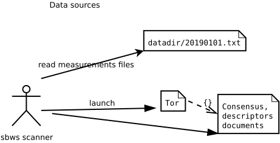

----

Initialize
------------

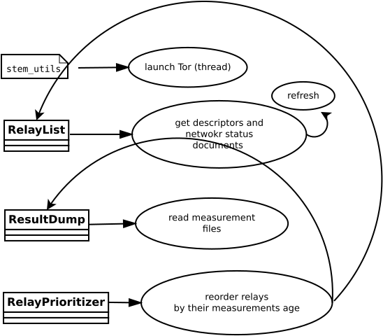

----

Initialize
------------

1. Parse the command line arguments and configuration files.
1. Launch or connect to a Tor daemon with an specific configuration.
1. Obtain the list of relays in the Tor network.
1. Read the old bandwidth measurements stored in the file system.
1. Obtain a subset of the relays ordered by:
   1. relays not measured.
   1. measurements age.

----

Perform the measurements
-------------------------

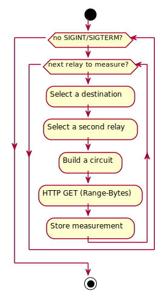

----

Perform the measurements
-------------------------

1. For every relay:
   1. Select a second relay to build a Tor circuit.
   1. Build the circuit.
   1. Make HTTPS GET requests to the Web server over the circuit.
   1. Store the time the request took and the amount of bytes requested.

----

Select a second relay
--------------------------

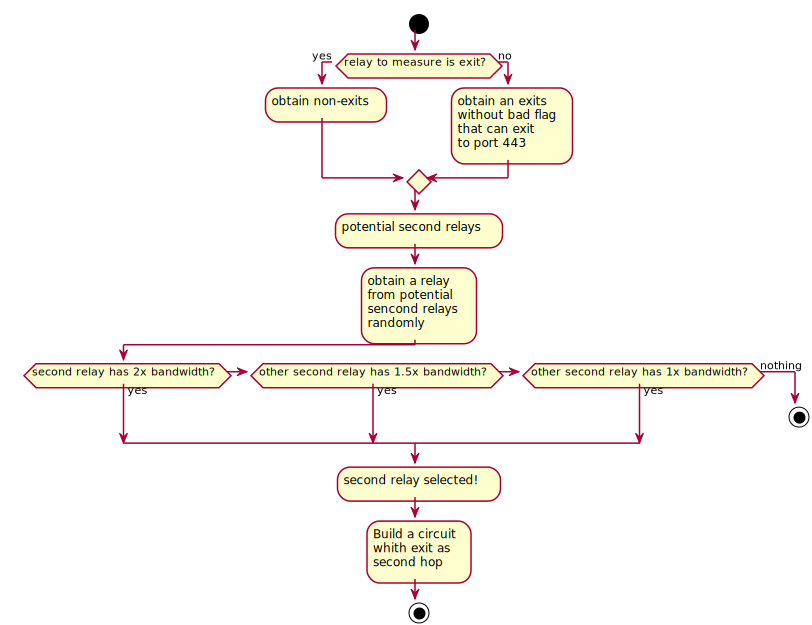

----

Select the download size
-------------------------


----

Classes
--------

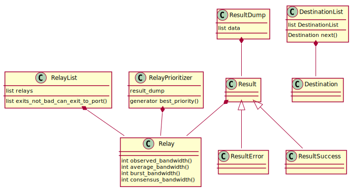

----

sbws scanner threads
-----------------------

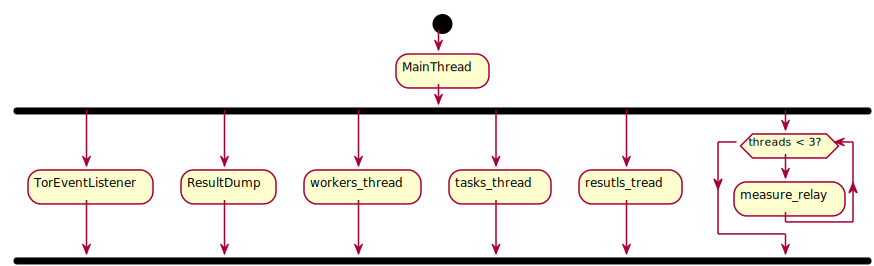

----

Critical sections
------------------

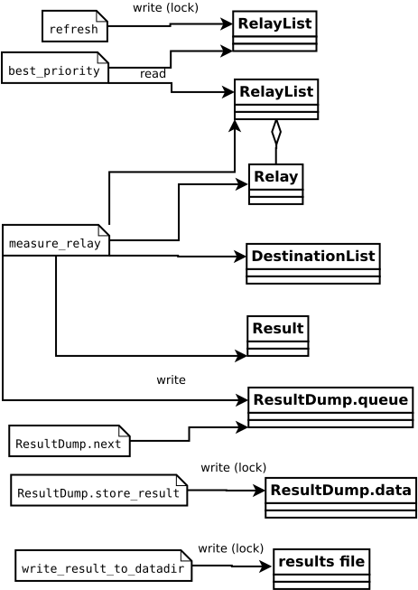

----  ----

Generate the bandwidth file
=============================

```
sbws generate
```

----

How the bandwidth file is generated
-------------------------------------
Every hour filter and scale the bandwidth measurements and write a bandwidth
file that will be read by a directory authority.

----

Filtering measurements
---------------------

For every relay that has measurements:

1. The measurements are not older than 5 days.
1. There at least 2 measurements and they were took with a day difference.

----

Scaling measurements
---------------------

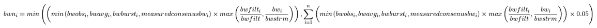

----  ----

Bandwidth file
================

Specification

https://gitweb.torproject.org/torspec.git/tree/bandwidth-file-spec.txt

----

Torflow Bandwidth file
-----------------------

`aka v1.0.0`

```text
1523911758
node_id=$68A483E05A2ABDCA6DA5A3EF8DB5177638A27F80 bw=760 nick=Test measured_at=1523911725 updated_at=1523911725 pid_error=4.11374090719 pid_error_sum=4.11374090719 pid_bw=57136645 pid_delta=2.12168374577 circ_fail=0.2 scanner=/filepath
node_id=$96C15995F30895689291F455587BD94CA427B6FC bw=189 nick=Test2 measured_at=1523911623 updated_at=1523911623 pid_error=3.96703337994 pid_error_sum=3.96703337994 pid_bw=47422125 pid_delta=2.65469736988 circ_fail=0.0 scanner=/filepath
```

----

sbws Bandwidth file
---------------------

v1.1.0 example

```text
1523911758
version=1.1.0
software=sbws
software_version=0.1.0
latest_bandwidth=2018-04-16T20:49:18
file_created=2018-04-16T21:49:18
generator_started=2018-04-16T15:13:25
earliest_bandwidth=2018-04-16T15:13:26
====
bw=380 error_circ=0 error_misc=0 error_stream=1 master_key_ed25519=YaqV4vbvPYKucElk297eVdNArDz9HtIwUoIeo0+cVIpQ nick=Test node_id=$68A483E05A2ABDCA6DA5A3EF8DB5177638A27F80 rtt=380 success=1 time=2018-05-08T16:13:26
bw=189 error_circ=0 error_misc=0 error_stream=0 master_key_ed25519=a6a+dZadrQBtfSbmQkP7j2ardCmLnm5NJ4ZzkvDxbo0I nick=Test2 node_id=$96C15995F30895689291F455587BD94CA427B6FC rtt=378 success=1 time=2018-05-08T16:13:36
```

----

sbws Bandwidth file
----------------------

```text
1523911758
version=1.2.0
latest_bandwidth=2018-04-16T20:49:18
file_created=2018-04-16T21:49:18
generator_started=2018-04-16T15:13:25
earliest_bandwidth=2018-04-16T15:13:26
minimum_number_eligible_relays=3862
minimum_percent_eligible_relays=60
number_consensus_relays=6436
number_eligible_relays=6000
percent_eligible_relays=93
software=sbws
software_version=1.0.3
=====
bw=38000 bw_mean=1127824 bw_median=1180062 desc_avg_bw=1073741824 desc_obs_bw_last=17230879 desc_obs_bw_mean=14732306 error_circ=0 error_misc=0 error_stream=1 master_key_ed25519=YaqV4vbvPYKucElk297eVdNArDz9HtIwUoIeo0+cVIpQ nick=Test node_id=$68A483E05A2ABDCA6DA5A3EF8DB5177638A27F80 rtt=380 success=1 time=2018-05-08T16:13:26
bw=1 bw_mean=199162 bw_median=185675 desc_avg_bw=409600 desc_obs_bw_last=836165 desc_obs_bw_mean=858030 error_circ=0 error_misc=0 error_stream=0 master_key_ed25519=a6a+dZadrQBtfSbmQkP7j2ardCmLnm5NJ4ZzkvDxbo0I nick=Test2 node_id=$96C15995F30895689291F455587BD94CA427B6FC rtt=378 success=1 time=2018-05-08T16:13:36
```

----  ----

Questions 
==========

----

- Can we vote for a relay's bandwidth if we have only measured it once?

----

- Can we make a bandwidth file with only one relay? (#28158)

----

- If a relay keeps failing measurements, what do we need to know to help the operator?

----  ----

How bandwidth files will appear in Tor
=======================================

----

Votes
------

moria, using Tor 0.3.5.7:

```text
bandwidth-file-headers timestamp=1548181637
```

https://collector.torproject.org/recent/relay-descriptors/votes/2019-01-22-19-00-00-vote-D586D18309DED4CD6D57C18FDB97EFA96D330566-7813764BF9884708741EFC6A4B2F7B22BF463B0A

----

Votes
------

To appear in Tor v0.4.1.x:

```text
bandwidth-file-digest sha256=01234567890123456789abcdefghijkl
```

https://trac.torproject.org/projects/tor/ticket/26698

----

Bandwidth files available as other documents
---------------------------------------------

To appear in Tor v0.4.1.x:

```text
/tor/status-vote/next/bandwidth.z
```

https://trac.torproject.org/projects/tor/ticket/21377

----  ----

Metrics - bandwidth authorities
=====================================

----

Current bandwidth authorities
-----------------------------

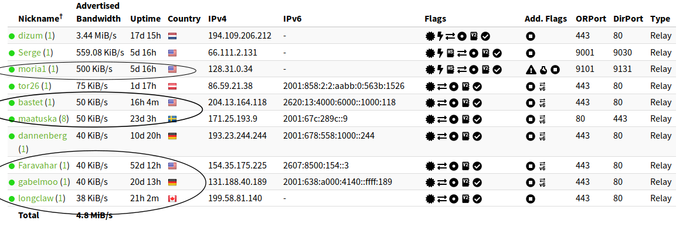

https://metrics.torproject.org/rs.html#search/flag:Authority

----

Bandwidth Authorities - Measured Relays past 7 days
----------------------------------------------------

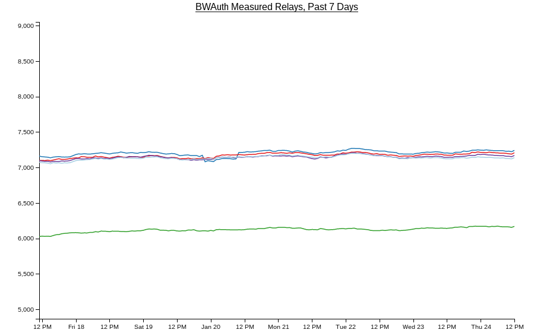

https://consensus-health.torproject.org/graphs.html

----

Bandwidth Authorities - Measured Relays past 90 days
----------------------------------------------------

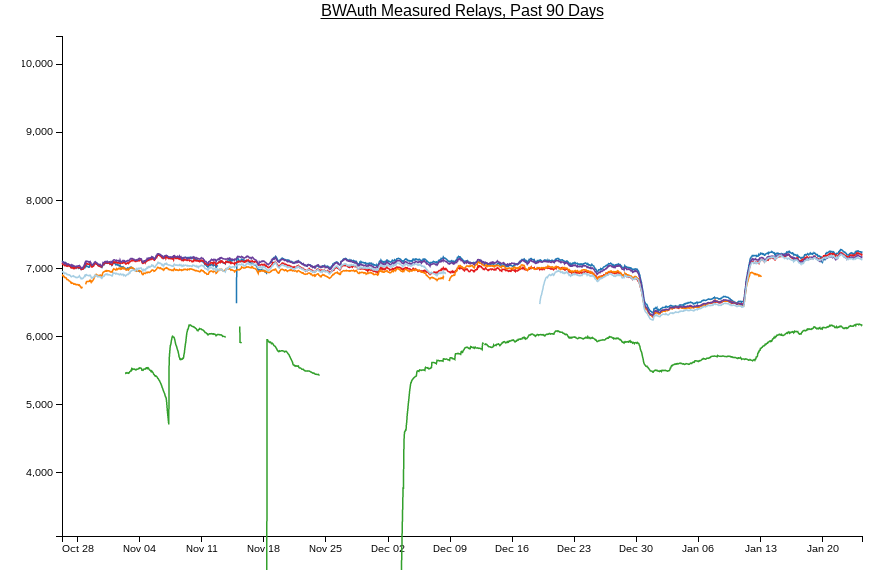

https://consensus-health.torproject.org/graphs.html

----  ----

Metrics - monitoring bandwidth
================================

----

Total bandwidth
----------------

should not decrease

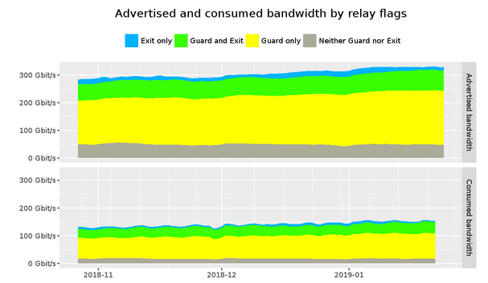

​https://metrics.torproject.org/bandwidth-flags.html

----

Time to download a file
------------------------

should not increase

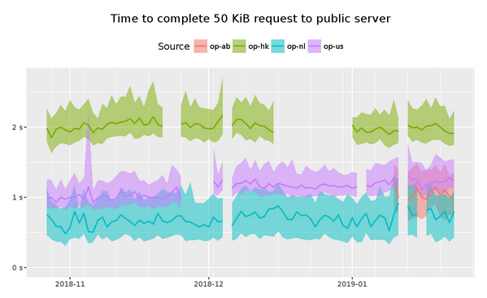

​https://metrics.torproject.org/torperf.html

----

Total consensus weights across bandwidth authorities
-------------------------------------------------------

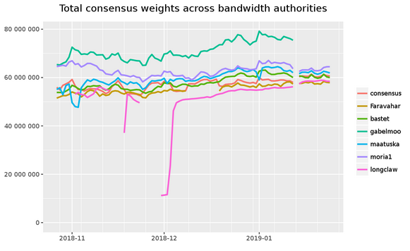

​https://metrics.torproject.org/totalcw.html

----  ----

Bandwidth values in Tor
========================

- relays' torrc bandwidth configuration (configured by operators)
- relays' self-measured bandwidth (reported in descriptors)
  - bandwidth self-test on bootstrap (to be eliminated)
  - actual relay load
- measured bandwidths (reported by bandwidth scanners)
- consensus weights (reported by dirauths)

----

Bandwidth self-test
--------------------

might be removed

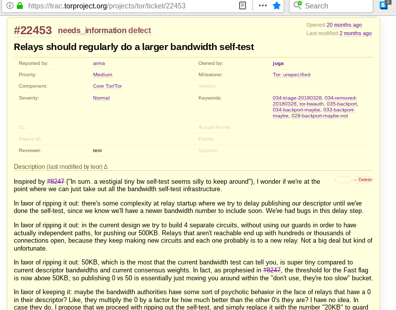

https://trac.torproject.org/projects/tor/ticket/22453

----

Bandwidth values in Tor
------------------------

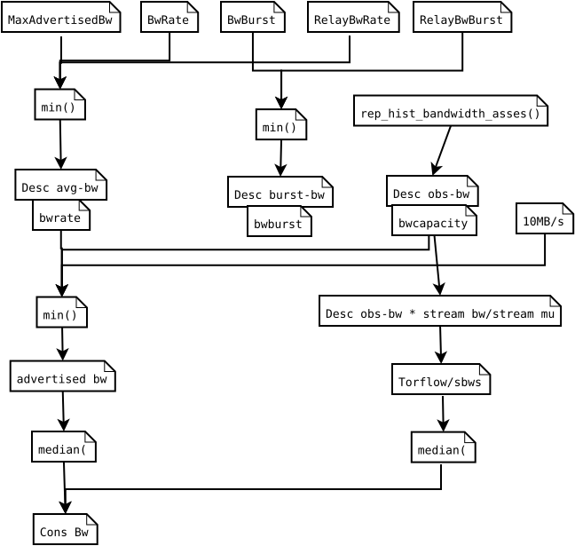

----  ----

Technical debt in Tor bandwidth
--------------------------------

`dirserv_read_measured_bandwidth`

https://trac.torproject.org/projects/tor/ticket/29133

----  ----

sbws Goals
============

----

sbws short term goals
-----------------------

1. Get sbws behave as torflow (done?)
1. Replace all torflows by sbws without measurements changing much
1. Get all the directory authorities to be bandwidth authorities

----

sbws not so far future goals
-----------------------------

What should be the Tor load balance goal?

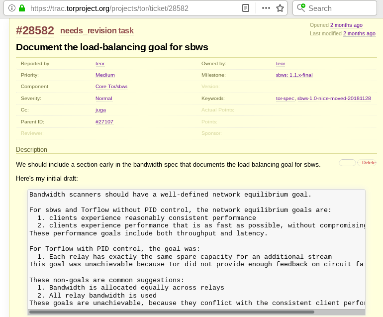

https://trac.torproject.org/projects/tor/ticket/28582

----  ----

sbws relays' bandwidth distribution
=====================================

----

sbws raw measurements compared to Torflow measurements
--------------------------------------------------------

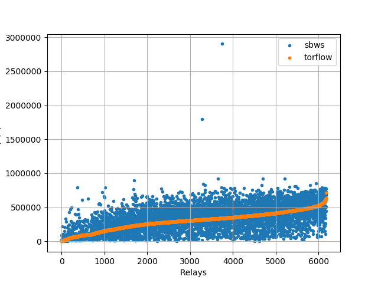

----

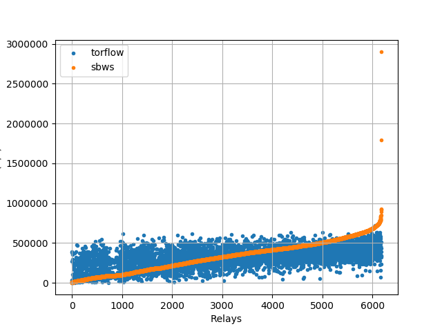

----

linear scaling
-------------

Multiply each relay bandwidth by `7500/median`

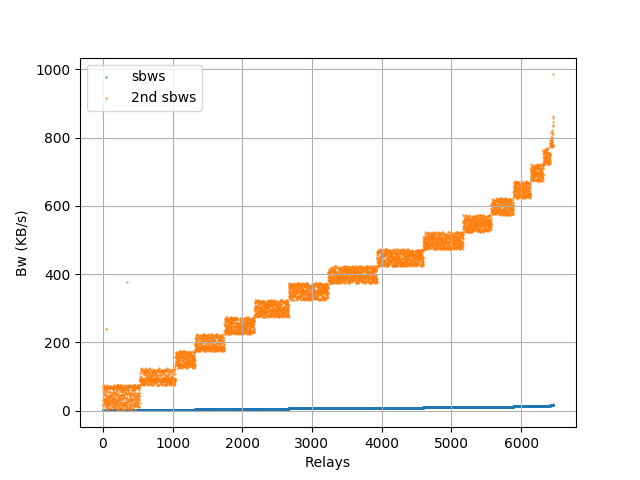

----

sbws scaling as Torflow
----------------------

Multiply each relay descriptor bandwidth by an small number

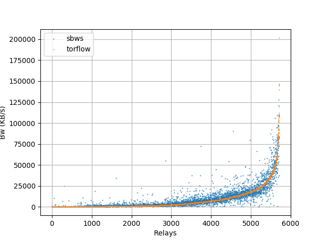

----  ----

sbws system packages
=====================

- Debian package (https://salsa.debian.org/pkg-privacy-team/sbws/)
- OpenBSD and FreeBsd

----  ----

Open questions
==============

**What should be the Tor load balance goal?**

----  ----

sbws technical debt
====================

- Data structure
- Logic
- Names of variables
- Style

----

New data structure idea
-------------------------

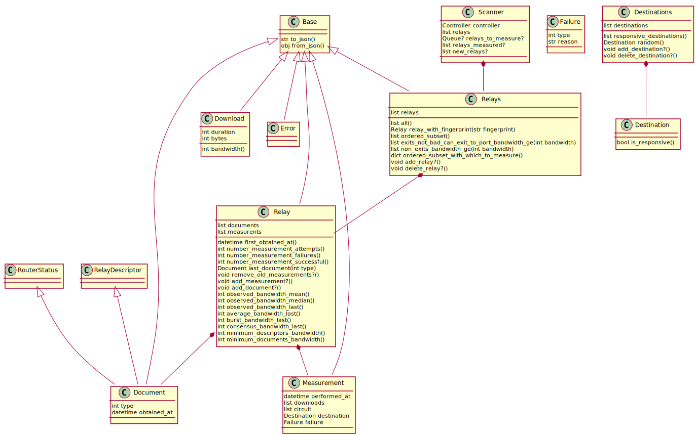
